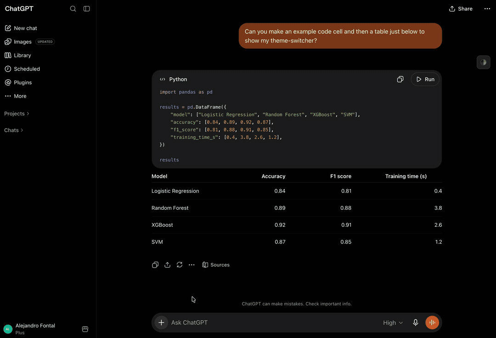

# ChatGPT Theme Switcher

A Tampermonkey userscript that adds a persistent theme switcher to ChatGPT.
I made this for my personal use, but since Tampermonkey requires a public URL for installation, I'm sharing it here for anyone who finds it useful.

## Demo

[](assets/theme-switcher-demo.mp4)

The recording keeps project and chat sections collapsed and uses a purpose-built example, so no conversation titles or message history are exposed. Click the preview to open the compressed MP4.

## Currently Included Themes

- IC Orange PPL
- Everforest
- Gruvbox Dark
- Catppuccin Mocha
- Tokyo Night
- Everforest Light Dim
- Nord Light Dim
- ChatGPT Default

## Structure

```text
src/
├── themes.js   # palettes only
├── styles.js   # ChatGPT and switcher CSS
└── app.js      # DOM detection, persistence, and switcher UI

scripts/
└── build.mjs   # zero-dependency bundler for the three source files

dist/
└── chatgpt-theme-switcher.user.js
```

Tampermonkey installs and auto-updates the bundled file in `dist/`. Development stays split across the files in `src/`.

## Install

First, make sure you have Tampermonkey installed in your browser. You can get it from [Tampermonkey's official website](https://www.tampermonkey.net/) and
install it as an extension for Chrome, Firefox, Edge, Safari and Opera (as far as I know).

With the extension installed, simply opening the following URL should prompt Tampermonkey to offer the installation of the userscript.

Open:

```text
https://raw.githubusercontent.com/AlFontal/chatgpt-theme-switcher/main/dist/chatgpt-theme-switcher.user.js
```

Tampermonkey should offer to install the userscript if it's not already installed, otherwise it will update the existing installation if a new release is available.

## Development

No npm dependencies are required. Node 22 is used by CI to build the userscript from the source files in `src/`.

```bash
npm run build
npm run check
```

The generated userscript is:

```text
dist/chatgpt-theme-switcher.user.js
```

## Publishing an update

Tampermonkey compares `@version`, which is generated from the version in `package.json`. Bump the package version for any update you want existing installations to receive:

```bash
npm run release:patch
```

or:

```bash
npm run release:minor
```

Then commit and push. The GitHub Action rebuilds `dist/` and commits it if necessary.

## Why the source is split

`themes.js` is intentionally just data, so palettes are easy to add and tune. `styles.js` contains the CSS generation. `app.js` contains ChatGPT DOM detection and the theme-picker behavior. The build step produces the one-file userscript Tampermonkey requires.

## Maintenance note

ChatGPT changes its DOM regularly, so the script may break quite easily. The script uses ChatGPT design tokens where possible and keeps the more fragile DOM-specific logic isolated in `app.js`.
